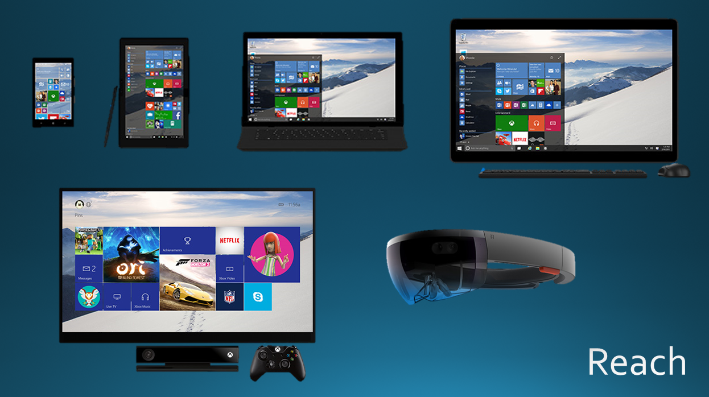
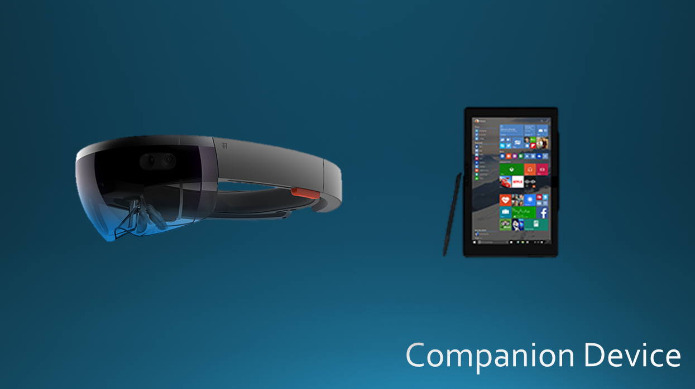
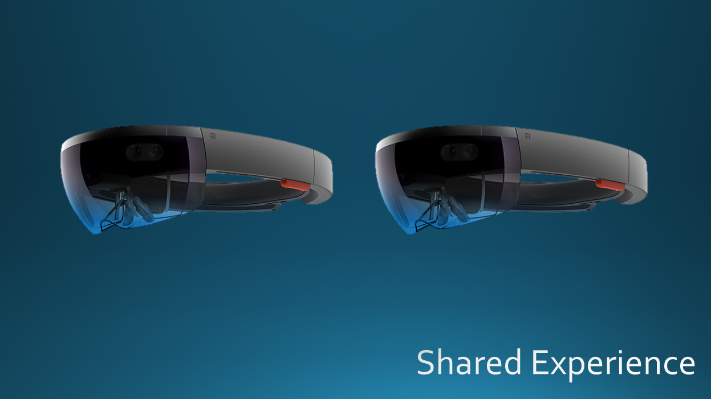
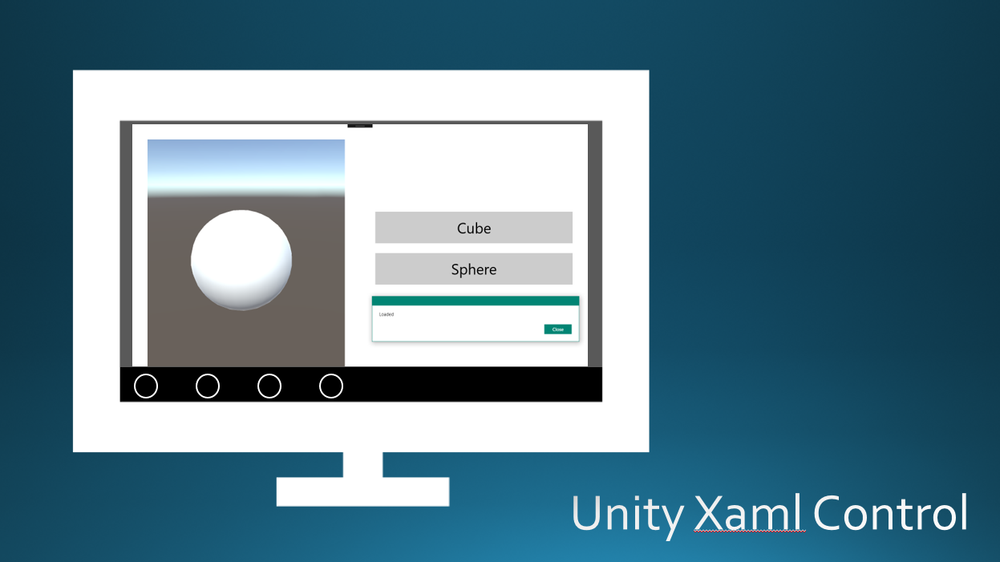
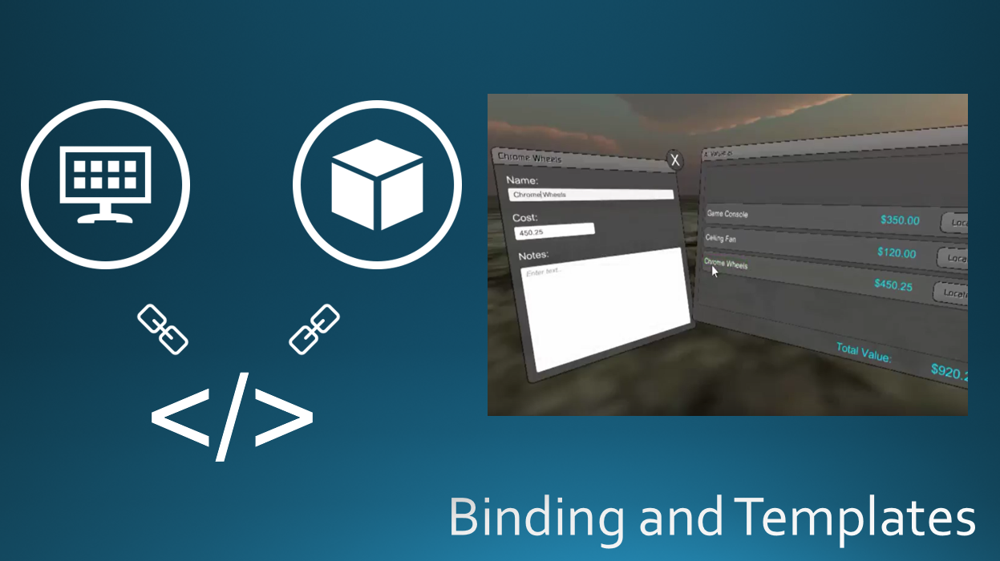
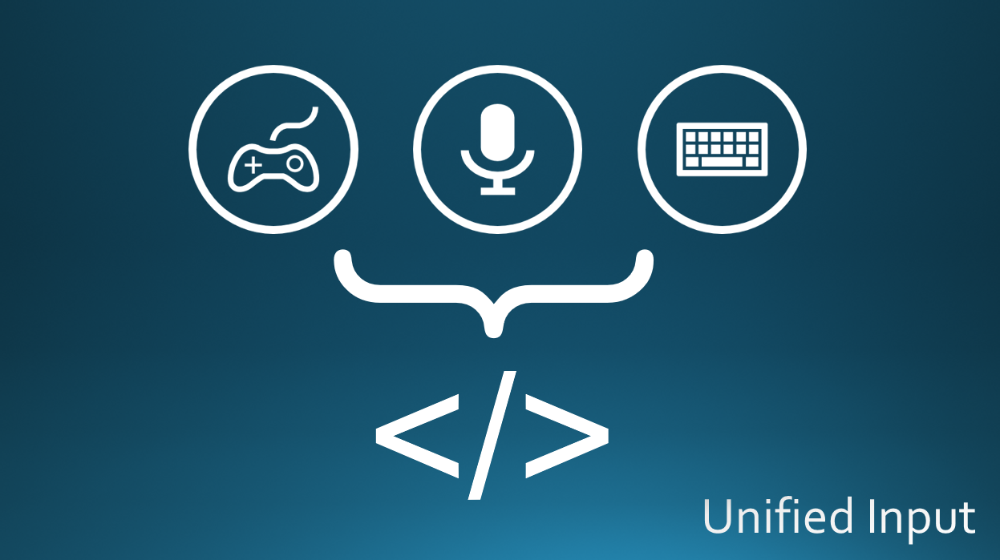

# Overview
Adept is a library for helping code adapt to different devices and environments running the Universal Windows Platform. Adept is especially designed to help share code between Xaml applications and HoloLens applications running Unity 3D. 

Adept was designed with the following scenarios in mind:

## Reach ##

Share as much code as possible between the XAML world and the Unity 3D world to enable write-once code that runs across all devices.

## Companion Device ##

Synchronizing state between an app running on HoloLens and an app running XAML on a phone or tablet to enable "companion" scenarios.

## Shared Experience ##

Synchronizing state between an app running on two or more HoloLenses to allow multiple users to share an app experience.

# Components
Adept offers several key components that help deliver the scenarios outlined above.

## Xaml Unity "Control" ##

Allows an entire Unity application to be run as an "island" within a XAMl application. Full interaction is supported between the two environments including the ability to run Unity coroutines in the XAML app and treat them as awaitable Tasks. Unity AsyncActions are event converted to Tasks that supply progress reports to the hosting xaml.

## Unity Data Binding and Templates ##

Adept offers full two-way data binding for Unity UI and even allows XAML-like data templates in Unity using prefabs. The binding system is also extensible so binding doesn't have to involve Unity UI. For example, a custom binder might monitor a string property and use it to load a named mesh. These features allows the MVVM pattern to be used in Unity and allow ViewModels (and therefore scenarios) to be shared between XAML and Unity. To see this feature in action, check out [this video](https://youtu.be/MrZd3Ldks14).

## Unified Input ##

Unity provides a fairly flexible input system out of the box for mouse, keyboard and gamepad, but this input system doesn't doesn't work in XAML apps. Adepts unified input system goes beyond what Unity offers to convert mouse, keyboard, gamepad, speech and even gestures into actions that can be carried out in Unity *and* the Xaml world.